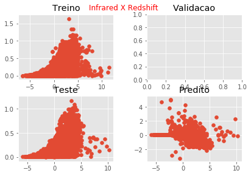
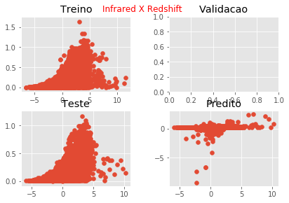
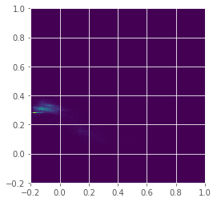
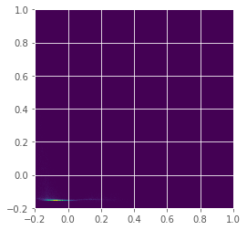
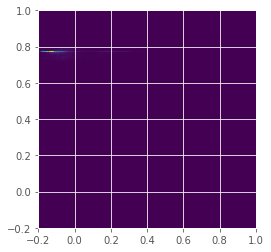
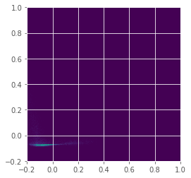

# BNN

## MSE 

|   |    |
|----|----|
| Pura| BN|
|     0.2776203     |     1431.4874 |
| Dropout | BN Dropout|
|         0.04186037  |      440.38028 |


## Distribuição 

|  Infrared x Redshift  |    |
|----|----|
| Pura| BN|
|          |      |
| Dropout | BN Dropout|
|           |       |


## HeatMap 

|  Predito x Real  |    |
|----|----|
| Pura| BN|
|          |      |
| Dropout | BN Dropout|
|           |       |

## Dados 

#### Pura
````
|     Real |   Predict |
|----------+-----------|
| 0.202258 |  0.557037 |
| 0.384286 | -0.731625 |
| 0.033815 |  0.108744 |
| 0.635514 | -1.29988  |
| 0.082844 |  0.269997 |
| 0.077451 | -0.23827  |
| 0.173062 |  0.425078 |
| 0.140931 |  0.396097 |
| 0.042802 |  0.108744 |
| 0.080199 |  0.284326 |
| 0.159216 |  0.170565 |
| 0.275251 | -0.566579 |
| 0.137887 |  0.397328 |
| 0.242895 | -0.22633  |
| 0.085739 |  0.288172 |
| 0.167368 |  0.202879 |
| 0.049474 |  0.427979 |
| 0.389837 | -0.695813 |
| 0.175565 |  0.414898 |
| 0.12229  |  0.246472 |
| 0.18369  |  0.216901 |
| 0.066047 |  0.32148  |
| 0.101232 |  0.415404 |
| 0.188021 |  0.157066 |
| 0.25487  | -0.693357 |
| 0.088456 |  0.668529 |
| 0.135544 |  0.131313 |
| 0.333799 | -0.780702 |
| 0.257815 | -0.43631  |
| 0.066265 |  0.242011 |
| 0.085536 |  0.29313  |
| 0.380118 | -0.789931 |
| 0.14705  |  0.211362 |
| 0.503077 | -1.4672   |
| 0.071456 |  0.199561 |
| 0.001909 |  1.67941  |
| 0.146141 |  0.399454 |
| 0.343    | -0.731561 |
| 0.119272 |  0.324426 |
| 0.073871 |  0.236975 |
| 0.334592 | -0.905882 |
| 0.105794 |  0.116283 |
| 0.095248 |  0.236974 |
| 0.193394 |  0.39352  |
| 0.047248 |  0.314561 |
| 0.058266 |  0.332595 |
| 0.134502 |  0.640071 |
| 0.092814 |  0.683266 |
| 0.115855 |  0.236316 |
| 0.058798 |  0.513891 |
````
#### BN
````
|     Real |    Predict |
|----------+------------|
| 0.202258 |   -9.91739 |
| 0.384286 |  -21.7548  |
| 0.033815 | -125.939   |
| 0.635514 |  -67.6834  |
| 0.082844 |  -54.3042  |
| 0.077451 |  -22.731   |
| 0.173062 |   -5.25784 |
| 0.140931 |   -5.18774 |
| 0.042802 | -127.798   |
| 0.080199 |  -16.475   |
| 0.159216 |   -6.59303 |
| 0.275251 |  -14.1514  |
| 0.137887 |   -4.74995 |
| 0.242895 |  -31.913   |
| 0.085739 |   -5.17864 |
| 0.167368 |   -7.30798 |
| 0.049474 |  -14.9451  |
| 0.389837 |  -16.8362  |
| 0.175565 |   -7.29279 |
| 0.12229  |  -22.6214  |
| 0.18369  |   -5.14014 |
| 0.066047 |  -49.9622  |
| 0.101232 |  -12.9396  |
| 0.188021 |   -5.33908 |
| 0.25487  |  -42.8379  |
| 0.088456 |  -10.2003  |
| 0.135544 |  -18.1423  |
| 0.333799 |  -20.302   |
| 0.257815 |  -47.3306  |
| 0.066265 |  -24.2571  |
| 0.085536 |   -5.88464 |
| 0.380118 |  -24.8895  |
| 0.14705  |   -6.91112 |
| 0.503077 |  -46.2176  |
| 0.071456 |   -5.45524 |
| 0.001909 |  -33.3151  |
| 0.146141 |   -8.12564 |
| 0.343    |  -79.6855  |
| 0.119272 |  -15.8262  |
| 0.073871 |   -5.16124 |
| 0.334592 |  -30.2784  |
| 0.105794 |   -6.19228 |
| 0.095248 |   -6.24208 |
| 0.193394 |   -6.62492 |
| 0.047248 |  -65.2878  |
| 0.058266 |  -32.3127  |
| 0.134502 |   -8.31716 |
| 0.092814 |  -11.1091  |
| 0.115855 |  -19.6269  |
| 0.058798 |  -11.2346  |
````

#### Dropout
````
|     Real |    Predict |
|----------+------------|
| 0.202258 |  0.226336  |
| 0.384286 |  0.0407948 |
| 0.033815 |  0.20958   |
| 0.635514 |  0.242374  |
| 0.082844 |  0.20958   |
| 0.077451 |  0.20958   |
| 0.173062 | -0.236602  |
| 0.140931 |  0.194552  |
| 0.042802 |  0.20958   |
| 0.080199 |  0.20958   |
| 0.159216 |  0.140774  |
| 0.275251 | -0.172015  |
| 0.137887 |  0.0989313 |
| 0.242895 |  0.20958   |
| 0.085739 |  0.252573  |
| 0.167368 | -0.298011  |
| 0.049474 |  0.408853  |
| 0.389837 | -0.0387697 |
| 0.175565 | -0.198047  |
| 0.12229  |  0.169598  |
| 0.18369  |  0.0768742 |
| 0.066047 |  0.20958   |
| 0.101232 |  0.219214  |
| 0.188021 |  0.301368  |
| 0.25487  |  0.330902  |
| 0.088456 |  0.213368  |
| 0.135544 |  0.152632  |
| 0.333799 |  0.0347942 |
| 0.257815 |  0.244823  |
| 0.066265 |  0.135679  |
| 0.085536 |  0.0669235 |
| 0.380118 |  0.19518   |
| 0.14705  |  0.101114  |
| 0.503077 |  0.20958   |
| 0.071456 |  0.150927  |
| 0.001909 | -0.127515  |
| 0.146141 |  0.323427  |
| 0.343    |  0.276113  |
| 0.119272 |  0.20958   |
| 0.073871 |  0.0659895 |
| 0.334592 |  0.202289  |
| 0.105794 |  0.101083  |
| 0.095248 | -0.102649  |
| 0.193394 | -0.111283  |
| 0.047248 |  0.20958   |
| 0.058266 |  0.374689  |
| 0.134502 |  0.203084  |
| 0.092814 |  0.214049  |
| 0.115855 |  0.122807  |
| 0.058798 |  0.218144  |
````

#### BN Dropout
````
|     Real |     Predict |
|----------+-------------|
| 0.202258 | -0.507564   |
| 0.384286 |  7.87325    |
| 0.033815 | 76.2638     |
| 0.635514 |  6.77537    |
| 0.082844 | 34.1367     |
| 0.077451 |  7.85697    |
| 0.173062 |  1.83735    |
| 0.140931 |  1.39884    |
| 0.042802 | 79.26       |
| 0.080199 |  1.34161    |
| 0.159216 |  1.05073    |
| 0.275251 |  4.17254    |
| 0.137887 |  1.46948    |
| 0.242895 |  8.38526    |
| 0.085739 |  0.956144   |
| 0.167368 |  1.99768    |
| 0.049474 |  3.19454    |
| 0.389837 |  4.37155    |
| 0.175565 |  1.66718    |
| 0.12229  |  6.84619    |
| 0.18369  |  2.01163    |
| 0.066047 | 26.455      |
| 0.101232 | -0.720276   |
| 0.188021 |  1.77467    |
| 0.25487  |  4.78739    |
| 0.088456 |  0.632802   |
| 0.135544 |  3.09875    |
| 0.333799 |  3.11801    |
| 0.257815 |  9.39278    |
| 0.066265 | 10.2693     |
| 0.085536 | -0.00856748 |
| 0.380118 |  2.4162     |
| 0.14705  |  2.15089    |
| 0.503077 | 10.5579     |
| 0.071456 |  1.31214    |
| 0.001909 |  5.09807    |
| 0.146141 |  0.279319   |
| 0.343    |  7.09882    |
| 0.119272 |  2.97361    |
| 0.073871 |  1.21624    |
| 0.334592 |  2.32714    |
| 0.105794 |  1.53368    |
| 0.095248 |  1.6196     |
| 0.193394 |  2.07514    |
| 0.047248 | 38.2043     |
| 0.058266 | 15.2116     |
| 0.134502 |  0.324968   |
| 0.092814 |  0.435591   |
| 0.115855 |  4.62924    |
| 0.058798 | -0.00409098 |
````