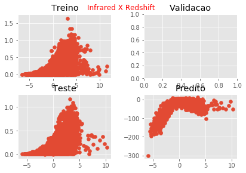

# BNN

## MSE 

|   |    |
|----|----|
| Pura| BN|
|     0.2776203     |     727.85016 |
| Dropout | BN Dropout|
|         0  |      0 |


## Distribuição 

|  Infrared x Redshift  |    |
|----|----|
| Pura| BN|
|          |      |
| Dropout | BN Dropout|
|           |       |


## HeatMap 

|  Predito x Real  |    |
|----|----|
| Pura| BN|
|          |      |
| Dropout | BN Dropout|
|           |       |

## Dados 

#### Pura
````
|     Real |   Predict |
|----------+-----------|
| 0.202258 |  0.557037 |
| 0.384286 | -0.731625 |
| 0.033815 |  0.108744 |
| 0.635514 | -1.29988  |
| 0.082844 |  0.269997 |
| 0.077451 | -0.23827  |
| 0.173062 |  0.425078 |
| 0.140931 |  0.396097 |
| 0.042802 |  0.108744 |
| 0.080199 |  0.284326 |
| 0.159216 |  0.170565 |
| 0.275251 | -0.566579 |
| 0.137887 |  0.397328 |
| 0.242895 | -0.22633  |
| 0.085739 |  0.288172 |
| 0.167368 |  0.202879 |
| 0.049474 |  0.427979 |
| 0.389837 | -0.695813 |
| 0.175565 |  0.414898 |
| 0.12229  |  0.246472 |
| 0.18369  |  0.216901 |
| 0.066047 |  0.32148  |
| 0.101232 |  0.415404 |
| 0.188021 |  0.157066 |
| 0.25487  | -0.693357 |
| 0.088456 |  0.668529 |
| 0.135544 |  0.131313 |
| 0.333799 | -0.780702 |
| 0.257815 | -0.43631  |
| 0.066265 |  0.242011 |
| 0.085536 |  0.29313  |
| 0.380118 | -0.789931 |
| 0.14705  |  0.211362 |
| 0.503077 | -1.4672   |
| 0.071456 |  0.199561 |
| 0.001909 |  1.67941  |
| 0.146141 |  0.399454 |
| 0.343    | -0.731561 |
| 0.119272 |  0.324426 |
| 0.073871 |  0.236975 |
| 0.334592 | -0.905882 |
| 0.105794 |  0.116283 |
| 0.095248 |  0.236974 |
| 0.193394 |  0.39352  |
| 0.047248 |  0.314561 |
| 0.058266 |  0.332595 |
| 0.134502 |  0.640071 |
| 0.092814 |  0.683266 |
| 0.115855 |  0.236316 |
| 0.058798 |  0.513891 |
````
#### BN
````
|     Real |     Predict |
|----------+-------------|
| 0.202258 |  -0.538581  |
| 0.384286 |   3.0063    |
| 0.033815 | 110.966     |
| 0.635514 |   4.81582   |
| 0.082844 |  29.965     |
| 0.077451 |  -2.72872   |
| 0.173062 |  -1.04489   |
| 0.140931 |  -1.28106   |
| 0.042802 | 112.537     |
| 0.080199 |   2.35825   |
| 0.159216 |  -0.19705   |
| 0.275251 |  -0.183642  |
| 0.137887 |  -1.30544   |
| 0.242895 |  -2.91316   |
| 0.085739 |  -0.878743  |
| 0.167368 |  -0.552011  |
| 0.049474 |   3.20408   |
| 0.389837 |   1.81767   |
| 0.175565 |  -0.301778  |
| 0.12229  |   4.84008   |
| 0.18369  |  -0.854689  |
| 0.066047 |  25.4591    |
| 0.101232 |   0.835889  |
| 0.188021 |  -1.22809   |
| 0.25487  |  11.3405    |
| 0.088456 |   0.235237  |
| 0.135544 |   0.941298  |
| 0.333799 |   2.39497   |
| 0.257815 |  -3.51992   |
| 0.066265 |   5.72326   |
| 0.085536 |  -1.06552   |
| 0.380118 |   8.84658   |
| 0.14705  |   0.503508  |
| 0.503077 |   9.20986   |
| 0.071456 |  -0.912182  |
| 0.001909 |   2.37095   |
| 0.146141 |  -1.91883   |
| 0.343    |  -4.37219   |
| 0.119272 |   2.32726   |
| 0.073871 |  -1.12365   |
| 0.334592 |  11.2388    |
| 0.105794 |   0.136472  |
| 0.095248 |  -0.604303  |
| 0.193394 |  -0.410412  |
| 0.047248 |  43.7643    |
| 0.058266 |  12.738     |
| 0.134502 |   0.0234727 |
| 0.092814 |   0.571012  |
| 0.115855 |   2.71558   |
| 0.058798 |  -0.140805  |
````

#### Dropout

#### BN Dropout
