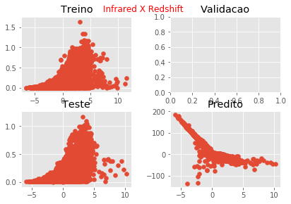
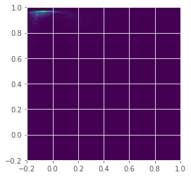

# BNN

## MSE 

|   |    |
|----|----|
| Pura| BN|
|     0.2776203     |     490.802 |
| Dropout | BN Dropout|
|         0.04186037  |      278.25867 |

### Melhor resultado
Usando a técnica de dropout: 

(kp=0.75)

MSE em 10 experimentos
````
0.020203365, 0.05111794,  0.124432035, 0.11397301, 0.054242108,
0.03168174,  0.019679347, 0.04463508,  0.07244529, 0.05915665722222222
````
Melhor resultado: `0.019679347`

Média em 10 resultados: `0.05915665722222222`

Desvio padrão em 10 resultados: `0.034018573286292965`


## Distribuição 

|  Infrared x Redshift  |    |
|----|----|
| Pura| BN|
|          |      |
| Dropout | BN Dropout|
|           |       |


## HeatMap 

|  Predito x Real  |    |
|----|----|
| Pura| BN|
|          |      |
| Dropout | BN Dropout|
|           |       |

## Dados 

#### Pura
````
|     Real |   Predict |
|----------+-----------|
| 0.202258 |  0.557037 |
| 0.384286 | -0.731625 |
| 0.033815 |  0.108744 |
| 0.635514 | -1.29988  |
| 0.082844 |  0.269997 |
| 0.077451 | -0.23827  |
| 0.173062 |  0.425078 |
| 0.140931 |  0.396097 |
| 0.042802 |  0.108744 |
| 0.080199 |  0.284326 |
| 0.159216 |  0.170565 |
| 0.275251 | -0.566579 |
| 0.137887 |  0.397328 |
| 0.242895 | -0.22633  |
| 0.085739 |  0.288172 |
| 0.167368 |  0.202879 |
| 0.049474 |  0.427979 |
| 0.389837 | -0.695813 |
| 0.175565 |  0.414898 |
| 0.12229  |  0.246472 |
| 0.18369  |  0.216901 |
| 0.066047 |  0.32148  |
| 0.101232 |  0.415404 |
| 0.188021 |  0.157066 |
| 0.25487  | -0.693357 |
| 0.088456 |  0.668529 |
| 0.135544 |  0.131313 |
| 0.333799 | -0.780702 |
| 0.257815 | -0.43631  |
| 0.066265 |  0.242011 |
| 0.085536 |  0.29313  |
| 0.380118 | -0.789931 |
| 0.14705  |  0.211362 |
| 0.503077 | -1.4672   |
| 0.071456 |  0.199561 |
| 0.001909 |  1.67941  |
| 0.146141 |  0.399454 |
| 0.343    | -0.731561 |
| 0.119272 |  0.324426 |
| 0.073871 |  0.236975 |
| 0.334592 | -0.905882 |
| 0.105794 |  0.116283 |
| 0.095248 |  0.236974 |
| 0.193394 |  0.39352  |
| 0.047248 |  0.314561 |
| 0.058266 |  0.332595 |
| 0.134502 |  0.640071 |
| 0.092814 |  0.683266 |
| 0.115855 |  0.236316 |
| 0.058798 |  0.513891 |
````
#### BN
````
|     Real |    Predict |
|----------+------------|
| 0.202258 |   4.80839  |
| 0.384286 |  -9.92234  |
| 0.033815 |  69.7727   |
| 0.635514 | -30.9325   |
| 0.082844 |  40.8067   |
| 0.077451 |  -4.89532  |
| 0.173062 |   2.25363  |
| 0.140931 |   1.49761  |
| 0.042802 |  78.0851   |
| 0.080199 |   9.55205  |
| 0.159216 |   2.54972  |
| 0.275251 |  -4.60434  |
| 0.137887 |   1.66449  |
| 0.242895 |  -6.00512  |
| 0.085739 |   2.42628  |
| 0.167368 |  -1.75377  |
| 0.049474 |   4.99231  |
| 0.389837 |  -7.20619  |
| 0.175565 |   2.43331  |
| 0.12229  |  16.3508   |
| 0.18369  |   3.0476   |
| 0.066047 |  36.442    |
| 0.101232 |   8.54948  |
| 0.188021 |   0.790353 |
| 0.25487  |  -9.43778  |
| 0.088456 |   5.15318  |
| 0.135544 |  12.6708   |
| 0.333799 |  -9.08776  |
| 0.257815 | -17.4784   |
| 0.066265 |  18.4213   |
| 0.085536 |   2.00131  |
| 0.380118 | -13.0256   |
| 0.14705  |   4.56151  |
| 0.503077 | -24.9606   |
| 0.071456 |   2.03127  |
| 0.001909 | -13.6397   |
| 0.146141 |   2.52679  |
| 0.343    | -23.4999   |
| 0.119272 |  11.2721   |
| 0.073871 |   2.61274  |
| 0.334592 | -16.037    |
| 0.105794 |   2.43543  |
| 0.095248 |   4.52853  |
| 0.193394 |   2.11871  |
| 0.047248 |  41.8162   |
| 0.058266 |   1.74785  |
| 0.134502 |   3.81041  |
| 0.092814 |   5.35244  |
| 0.115855 |  14.3371   |
| 0.058798 |   5.61624  |
````

#### Dropout
````
|     Real |    Predict |
|----------+------------|
| 0.202258 |  -1.58233  |
| 0.384286 |  -2.61737  |
| 0.033815 | -59.8061   |
| 0.635514 | -51.8015   |
| 0.082844 | -14.6071   |
| 0.077451 |  -2.7561   |
| 0.173062 |   2.67578  |
| 0.140931 |   1.16939  |
| 0.042802 | -64.6269   |
| 0.080199 |  -3.42637  |
| 0.159216 |   1.64097  |
| 0.275251 |  -3.06617  |
| 0.137887 |   1.23585  |
| 0.242895 |  -2.55777  |
| 0.085739 |   2.30251  |
| 0.167368 |   1.15367  |
| 0.049474 |   0.45185  |
| 0.389837 |  -1.85476  |
| 0.175565 |   3.13319  |
| 0.12229  |  -5.28007  |
| 0.18369  |   2.4802   |
| 0.066047 |  -2.59154  |
| 0.101232 |  -3.21415  |
| 0.188021 |   1.08232  |
| 0.25487  |  -6.93465  |
| 0.088456 |  -0.378539 |
| 0.135544 |  -4.90739  |
| 0.333799 |  -8.04018  |
| 0.257815 | -13.8384   |
| 0.066265 |  -6.81834  |
| 0.085536 |   1.76827  |
| 0.380118 | -15.0813   |
| 0.14705  |   1.64544  |
| 0.503077 | -43.6838   |
| 0.071456 |   0.35808  |
| 0.001909 |  -9.823    |
| 0.146141 |  -0.512268 |
| 0.343    | -33.1664   |
| 0.119272 |  -3.07563  |
| 0.073871 |   3.40607  |
| 0.334592 | -23.663    |
| 0.105794 |   2.45832  |
| 0.095248 |   3.12191  |
| 0.193394 |   2.6869   |
| 0.047248 | -24.8007   |
| 0.058266 |  -5.12127  |
| 0.134502 |   1.46114  |
| 0.092814 |   0.114009 |
| 0.115855 |  -7.11007  |
| 0.058798 |  -1.17581  |
````

#### BN Dropout
````
|     Real |     Predict |
|----------+-------------|
| 0.202258 | -0.507564   |
| 0.384286 |  7.87325    |
| 0.033815 | 76.2638     |
| 0.635514 |  6.77537    |
| 0.082844 | 34.1367     |
| 0.077451 |  7.85697    |
| 0.173062 |  1.83735    |
| 0.140931 |  1.39884    |
| 0.042802 | 79.26       |
| 0.080199 |  1.34161    |
| 0.159216 |  1.05073    |
| 0.275251 |  4.17254    |
| 0.137887 |  1.46948    |
| 0.242895 |  8.38526    |
| 0.085739 |  0.956144   |
| 0.167368 |  1.99768    |
| 0.049474 |  3.19454    |
| 0.389837 |  4.37155    |
| 0.175565 |  1.66718    |
| 0.12229  |  6.84619    |
| 0.18369  |  2.01163    |
| 0.066047 | 26.455      |
| 0.101232 | -0.720276   |
| 0.188021 |  1.77467    |
| 0.25487  |  4.78739    |
| 0.088456 |  0.632802   |
| 0.135544 |  3.09875    |
| 0.333799 |  3.11801    |
| 0.257815 |  9.39278    |
| 0.066265 | 10.2693     |
| 0.085536 | -0.00856748 |
| 0.380118 |  2.4162     |
| 0.14705  |  2.15089    |
| 0.503077 | 10.5579     |
| 0.071456 |  1.31214    |
| 0.001909 |  5.09807    |
| 0.146141 |  0.279319   |
| 0.343    |  7.09882    |
| 0.119272 |  2.97361    |
| 0.073871 |  1.21624    |
| 0.334592 |  2.32714    |
| 0.105794 |  1.53368    |
| 0.095248 |  1.6196     |
| 0.193394 |  2.07514    |
| 0.047248 | 38.2043     |
| 0.058266 | 15.2116     |
| 0.134502 |  0.324968   |
| 0.092814 |  0.435591   |
| 0.115855 |  4.62924    |
| 0.058798 | -0.00409098 |
````
