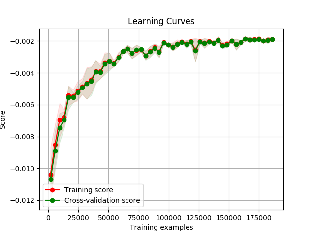

# Por Métrica

## Distribuição 

|  Infrared x Redshift  |    |
|----|----|
| ANN| KNN|
|----|----|
|          |      |
|----|----|
| RForest | LReg |
|----|----|
|           |       |
|----|----|

## HeatMap 

|  Predito x Real  |    |
|----|----|
| ANN| KNN|
|----|----|
|  |  |
|-----------------------------|-----------------------------|
| RForest | LReg |
|----|----|
|   |   |
|-----------------------------|-----------------------------|

# Por Modelo

## Redes Neurais

|  |  |  mean_squaded_error = 0.001099|
|----|----|----|
|  [1]|  | |
|----|----|----|
1. ANN: 2 camadas, com 175 unidades na camada 1 e 151 na camada 2 [dropout=0.1].

## Florestas Aleatóreas

|  |  |      mean_squaded_error = 0.001070       |
|----|----|----|

## K-Vizinhos mais próximos

|  |  |      mean_squaded_error = 0.001171       |
|----|----|----|

## Regressão Linear

|  |  |      mean_squaded_error = 0.002471       |
|----|----|----|
