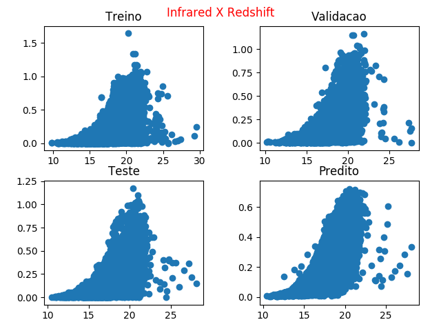
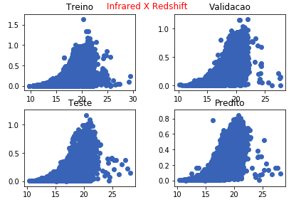
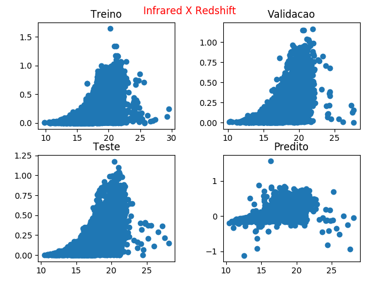

# Por Métrica

## Distribuição 

|  Infrared x Redshift  |    |
|----|----|
| ANN| KNN|
|----|----|
|          |      |
|----|----|
| RForest | LReg |
|----|----|
|           |       |
|----|----|

## HeatMap 

|  Predito x Real  |    |
|----|----|
| ANN| KNN|
|----|----|
|  |  |
|-----------------------------|-----------------------------|
| RForest | LReg |
|----|----|
|   |   |
|-----------------------------|-----------------------------|

# Por Modelo

## Redes Neurais

|  |  |  |
|----|----|----|

## Florestas Aleatóreas

|  |  |      N/A : mean_squaded_error!       |
|----|----|----|

## K-Vizinhos mais próximos

|  |  |      mean_squaded_error = 0.0011674860537731718       |
|----|----|----|

## Regressão Linear

|  |  |      mean_squaded_error = 0.0024200070183046925       |
|----|----|----|
